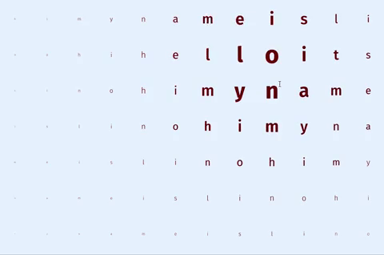

# interactive-web-sketches
A collection of interactive page ideas. Mostly CSS and JS, but who knows.

### Reactive Type 
This came out of a nice tutorial from Rik + team at SuperHi. It emulates [a showcase page](https://airbnb.design/cereal/scale/weight/) by Airbnb's design blog showing off their Cereal typeface (2018). 

Right now it feels like slightly-below-room-temperature butter. It could be smoother. 
